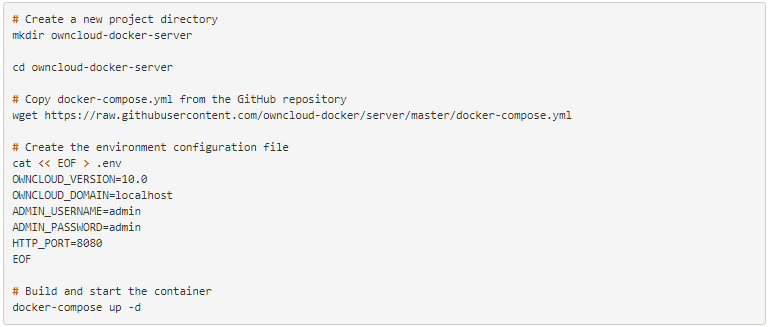
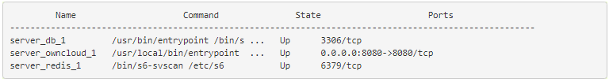
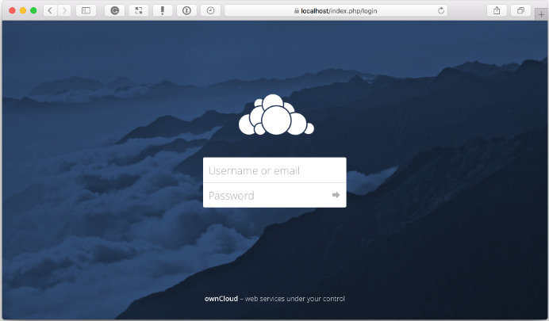
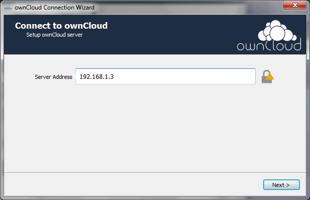

# ownCloud Quickstart Guide

### Abstract 

This guide shows you to how to get started with ownCloud 10.0.10. The guide introduces ownCloud 10.0.10 and shows how to install and configure a basic setup using ownCloud Server Community Edition and ownCloud Desktop Client.

---
## Chapter 1. Overview

#### 1.1. Key Features

The following list describes some key features of ownCloud 10.0.10.

- Synchronize calendar, mail, contacts, and pictures using dedicated apps
- Access and manage server files from a Web-based interface
- Upload gigabit-size files (exact file size limits are determined by server operating system)
- Remotely create, delete, move, and modify content of server files using _Web Distributed Authoring and Versioning_ (WebDAV)
- Manage file versions with a dedicated versioning app
- Tag, encrypt, and share files with other ownCloud users
- Create multiple public link shares, enabling flexibility in passwords, permissions, and expiry dates
- Mount ownCloud Server to remote storage services such as Google Drive, Dropbox, Amazon S3, FTP servers, and SharePoint
- Mount file shares from remote ownCloud servers

#### 1.2. About ownCloud Server

ownCloud Server is the central software component of the ownCloud system. It hosts and manages access to all your files and data.

ownCloud Server is available in the following editions:

- **Community Edition** – a free, community-supported server that is also the core server for other editions
- **Standard Edition** – a subscription-based edition that gives you paid support for the core server, without applications intended for enterprise use
- **Enterprise Edition** – a subscription-based edition that gives you paid support for the core server and also includes enterprise applications

ownCloud Server runs only on the Linux operating system, with support for the following distributions:

- Ubuntu 16.04 and 18.04
- Defiant 7 and 8
- Red Hat Enterprise Linux 6 and 7
- Centos Linux 6 and 7
- Fedora 27 and 28
- SUSE Linux Enterprise Server 12 with SP1, SP2, and SP3
- openSUSE Tumbleweed and Leap 15.0, 42.3
- Ubuntu 16.04 and 18.04

#### 1.3. About ownCloud Desktop Clients

Desktop clients enable you to synchronize files to ownCloud Server and remotely access and manage those files via a Web-based interface.

ownCloud desktop clients are available for:

- macOS (macOS X 10.12+, 64-bit only)
- Windows (Windows 7+)
- Linux (Latest 2 versions per platform and previous _long-term support_ (LTS) version)

---

## Chapter 2. Installation

#### 2.1. System Requirements

For detailed information about officially recommended and supported options for ownCloud 10.0.10, see [System Requirements](https://doc.owncloud.org/server/10.0/admin_manual/installation/system_requirements.html).

#### 2.2 Install ownCloud Server Community Edition

The procedures in this section show how to install ownCloud Server Community Edition on your Linux operating system. Specifically, the procedures show you how to:

- Use the ownCloud Docker image to install ownCloud Server files
- Create a user account for client connections

**Note:** The first procedure in this section installs ownCloud Server from a Docker image. For information about alternative ways to install ownCloud Server, see:
- [Manual Installation on Linux](https://doc.owncloud.org/server/10.0/admin_manual/installation/source_installation.html)
- [Linux Package Manager Installation](https://doc.owncloud.org/server/10.0/admin_manual/installation/linux_installation.html)
- [Command-Line Installation](https://doc.owncloud.org/server/10.0/admin_manual/installation/command_line_installation.html)

#### 2.2.1. Install ownCloud with Docker

This procedure shows you how to install ownCloud Server files using a Docker image. This image works with a data volume in the host file system and with separate MariaDB and Redis containers. Specifically, the configuration:

- Exposes port 8080, allowing for HTTP connections via this port.
- Mounts the data and MySQL data directories on the host machine for persistent storage.

**Prerequisites:** This procedure assumes that you have an available Docker command-line tool. The procedure shows an example using the _Docker Compose_ tool.

**Procedure**

1. On your sever host machine, create a new project directory.
2. In your Web browser, navigate to the [ownCloud Docker GitHub repository](https://github.com/owncloud-docker/server.git).
3. Download ``docker-compose.yml`` to your project directory.
4. In your project directory, create a new configuration file with the file extension .env, for example, ``owncloud.env``.
5. In your configuration file, specify the following settings.

   - OWNCLOUD\_VERSION: ``latest``
   - OWNCLOUD\_DOMAIN: ``localhost``
   - ADMIN\_USERNAME: <create\_admin\_username>
   - ADMIN\_PASSWORD: <create\_admin\_password>
   - HTTP\_PORT: ``8080``
   
6. Start the container using your preferred Docker command-line tool. The following figure shows how to do this using Docker Compose.

   

7. When the build and start processes are complete, check that the containers have started successfully. To do this, run ``docker-compose.ps``.

   If the containers are working, you should see output similar to that shown in the following figure.

   

   In the preceding figure, you can see that the database, ownCloud, and Redis containers are running.
   You can also see that ownCloud is accessible via port 8080 on the host machine. This means that clients can access ownCloud Server using the server IP address and port 8080, for example, ``192.168.1.3:8080``.

8. Open the ownCloud Web-based interface, known as the _WebUI_.  To do this, navigate to [http://localhost](http://localhost) in your Web browser. 
   
   
   
9. Log in to the WebUI using the administrator user name and password that you specified in your configuration file.

#### 2.2.2 Create a User Account

This procedure shows you how to use the openCloud WebUI to add a new user account.

**Procedure**

1. In your Web browser, navigate to [https://localhost](https://localhost). The ownCloud WebUI opens.
2. Log in to the WebUI using the administrator user name and password.
3. Open the **User Management** page of the WebUI.
4. At the top of the **User Management** page, specify a login name and default password for your new user. Optionally, add the user to a new or existing group.

   

4. Click **Create**.

#### 2.3. Install and Connect ownCloud Desktop Client

This procedure shows you how to install and connect the ownCloud Desktop Client for Windows. To download versions of the client for macOS or Linux, see the [ownCloud download page.](https://owncloud.com/download/#desktop-clients)

**Procedure**

1. In your Web browser, navigate to the [ownCloud download page](https://owncloud.com/download/#desktop-clients).
2. Next to **ownCloud Windows Client (.msi) 2.5.1,** click **Download Now.**
3. When the Windows installation package has downloaded, double-click the file. The _ownCloud Setup Wizard_ starts.
4. Follow the instructions in the setup wizard to install the client. When installation of the client is complete, the _ownCloud Connection Wizard_ starts.
5. In the connection wizard, specify the IP address of your ownCloud Server host, for example, ``192.168.1.3``. Click **Next**.

   
  
6. Enter the ownCloud user name and password that your administrator created for you. Click **Next**.

   
  
7. Sync all of the files currently on ownCloud Server, or specify files by clicking **Choose what to sync.** Optionally, specify a different destination folder on your client machine.

   
   
8. To connect to ownCloud Server, click **Connect**.
